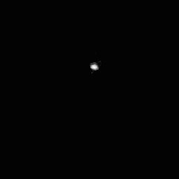
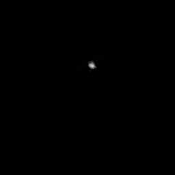
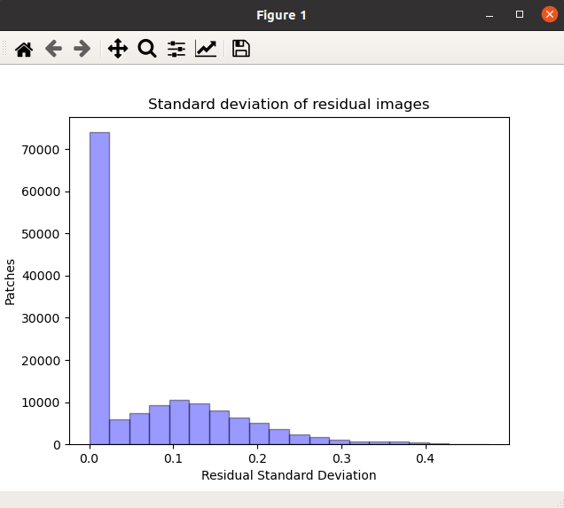

# Keras Implementation

This folder contains complete implementation of **MyDenoiser** using the 
[Keras Functional API](https://keras.io/guides/functional_api/).

## Testing

To test inference with this model, you can use the [test.py](test.py) script by 
running the following from a command line located at *.../MyDenoiser/keras_implementation/*

```
python3 test.py \
--set_dir=<parent_directory_of_test_dataset> \
--set_names=<list_of_names_of_dataset_folders_to_test_on> \
--model_dir=<directory_of_MyDenoiser_model> \
--model_name=<name_of_hdf5_model_file> \
--save_result=1

```

After testing the model, a file named *results.txt* will be saved in [*data/results/<set_name>*](old_data/results), 
where the set_name corresponds to set_names[i] from the command-line arguments shown above.  

If you specify the save_result command-line argument when running test.py (as shown above),
the denoised images will also be saved in [*data/results/<set_name>*](old_data/results), alongside *results.txt*


## Training

To train this model, use the [train.py](train.py) script by running the following from 
a command line located at *.../MyDenoiser/keras_implementation/*

```

python3 train.py /
--batch_size=<choose_batch_size> \
--train_data=<path_to_train_data_dir> \
--val_data=<path_to_val_data_dir> \
--epoch=<num_epochs> \

```
**Note:** If you don't specify a batch_size and epoch #, a default **batch_size** of 128 and **epoch #** of 300 will be chosen

## Results

| Dataset                                                     | Average PSNR (pre-Hydra) | Average SSIM (pre-Hydra) | Average PSNR (post-Hydra) | Average SSIM (post-Hydra) | Average PSNR (DnCNN) | Average SSIM (DnCNN) |
|-------------------------------------------------------------|--------------------------|--------------------------|---------------------------|---------------------------|----------------------|----------------------|
| [Volume 1 (val)](keras_implementation/data/Volume1/val)     | 29.00 dB                 | 0.6466                   | 28.47 dB                  | 0.9286                    | 
| [Volume 1 (test)](keras_implementation/data/Volume1/test)   | 28.50 dB                 | 0.6720                   |
| [Volume 1 (train)](keras_implementation/data/Volume1/train) | 30.01 dB                 | 0.6939                   |
| [Volume 2 (val)](keras_implementation/data/Volume2/val)     | N/A                      | N/A                      | 28.94 dB                  | 0.9623                    | 19.26 dB             | 0.4914               |

| Image dataset | Noisy Image                           | Denoised Image                          |
|:-------------:|:-------------------------------------:|:---------------------------------------:|
| train         |      |      |

# Volume 1 Residual Patches Distribution




## Creating TIFF from Results - *Dependencies: ImageMagick*

To convert the newly denoised PNG images after using MyDenoiser for inference, you can use the 
[utilities/png_folder_to_tiff.py](utilities/png_folder_to_tiff.py) script by running the following
from a command line located at *.../MyDenoiser/keras_implementation/*

```

python3 utilities/png_folder_to_tiff.py \
--png_folder=data/results/<results_subfolder> \
--output_folder=data/results/<choose_output_folder> \
--output_file_name=<output_file_name>

```
This command **will not** work if the user does not have ImageMagick installed. ImageMagick can be installed [here](https://www.tutorialspoint.com/how-to-install-imagemagick-on-ubuntu), among other places.

**Note:** By default, the output folder of the TIFF file is the same folder as the input *png_folder*.
